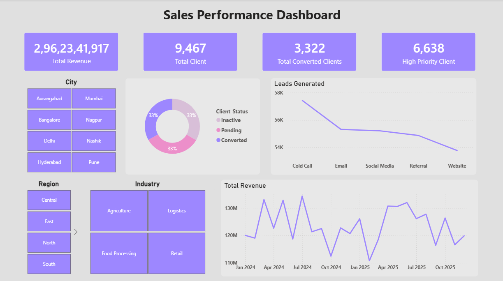

# Enterprise Sales & Client Follow-up MIS Dashboard

## 📊 Project Overview

This project focuses on building a **Management Information System (MIS) dashboard** to analyze sales performance, client engagement, and marketing campaign effectiveness.

The dataset contains **50,000+ records** representing sales operations of a marketing-focused company. The workflow includes **data preparation in Excel**, data transformation using **Power Query**, and building **interactive visual dashboards in Power BI** to convert raw data into meaningful business insights.

---

## 🎯 Project Objectives

* Analyze sales and revenue performance across different regions.
* Track **lead generation and deal conversions**.
* Monitor **client follow-ups and sales pipeline**.
* Evaluate **marketing campaign performance**.
* Provide data-driven insights for business decision-making.

---

## 🛠 Tools & Technologies

* Microsoft Excel (Data preparation & structuring)
* Power BI Desktop
* Power Query (Data Cleaning & Transformation)
* DAX (Data Analysis Expressions)
* Data Modeling
* CSV Dataset

---

## 📁 Dataset Information

The dataset simulates sales operations of a marketing company and contains **50,000+ records**.

### Key Columns

* Date
* Company_Name
* Client_ID
* Client_Name
* Industry
* Region
* City
* Sales_Executive
* Leads_Generated
* Deals_Closed
* Revenue_INR
* Campaign_Source
* Client_Status
* Followup_Required
* Priority

---

## 📈 Key Analysis Performed

The dashboard provides business insights such as:

* Monthly Revenue Trend Analysis
* Region-wise Revenue Performance
* Campaign Performance Analysis
* Sales Executive Performance Tracking
* Lead-to-Deal Conversion Analysis
* Client Status Distribution
* Follow-up Priority Monitoring

---

## 📊 Dashboard Features

* Interactive business dashboard
* KPI cards for **Total Revenue, Leads Generated, Deals Closed, and Conversion Rate**
* Dynamic filtering using **slicers (Region, Industry, Date)**
* Visual analysis using **bar charts, line charts, column charts, and pie charts**

---
### 📷 Dashboard Preview

Below is the preview of the Power BI dashboard created in this project.

> Note: Replace `dashboard-preview.png` with your actual dashboard screenshot file name uploaded in this repository.

## 💡 Key Insights

1️⃣ Sales Performance Trend

Insight:
The dashboard highlights overall sales performance trends over time, helping identify growth patterns, seasonal spikes, and potential revenue decline periods.

2️⃣ Top Performing Clients

Insight:
Client-level analysis identifies the highest revenue-generating customers, allowing businesses to focus on maintaining strong relationships with their most valuable clients.

3️⃣ Product / Service Contribution

Insight:
The analysis reveals which products or services contribute the most to total sales, enabling better decision-making for inventory planning and marketing focus.

4️⃣ Follow-up Management Efficiency

Insight:
The follow-up tracking system highlights pending and completed client interactions, ensuring no important customer communication is missed.

5️⃣ Priority-Based Task Monitoring

Insight:
The priority classification (High, Medium, Low) helps teams quickly identify urgent tasks and manage workload effectively.

---

## 🚀 Learning Outcomes

Through this project I learned:

* Preparing and structuring datasets using **Excel**
* Data cleaning and transformation using **Power Query**
* Building interactive dashboards in **Power BI**
* Writing **DAX measures** for business metrics
* Performing **sales and marketing performance analysis**

---

## 📌 Author

**Krushna Pawar**
B.Sc. Computer Science
